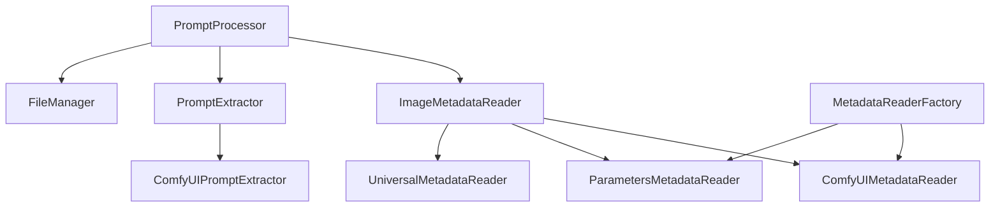

# ComfyUI 프롬프트 추출기

ComfyUI와 기타 AI 이미지 생성 도구에서 생성된 이미지로부터 긍정 프롬프트(Positive Prompt)를 추출하여 와일드카드 학습용 텍스트 파일로 저장하는 도구입니다.

## ✨ 주요 기능

- 🖼️ **다양한 형식 지원**: ComfyUI, WebUI(Automatic1111) 등의 이미지 메타데이터 형식 자동 감지
- 📁 **배치 처리**: 폴더 내 모든 이미지를 한 번에 처리
- 🎯 **단일 파일 처리**: 개별 이미지 파일에서 프롬프트 추출
- 🤖 **대화형 모드**: 직관적인 CLI 인터페이스
- 📝 **와일드카드 호환**: 추출된 프롬프트를 와일드카드 학습에 바로 사용 가능한 형태로 저장
- 🏗️ **모듈화 설계**: SOLID 원칙을 따른 확장 가능한 구조

## 🚀 설치 방법

### 요구사항
- Python 3.7+
- PIL (Pillow)

### 설치
```bash
# 저장소 클론
git clone <repository-url>
cd prompt_extractor

# 의존성 설치 (uv 사용 시)
uv sync

# 또는 pip 사용 시
pip install pillow
```

## 📖 사용법

### 1. 대화형 모드 (권장)
```bash
python main.py
```

대화형 메뉴가 나타나며, 원하는 작업을 선택할 수 있습니다:
- 단일 이미지 처리
- 폴더 배치 처리
- 프로그램 종료

### 2. CLI 명령어 모드

#### 단일 이미지 처리
```bash
# 기본 출력 경로 사용 (output/이미지이름.txt)
python main.py single image.png

# 사용자 지정 출력 경로
python main.py single image.png -o custom_output.txt
```

#### 폴더 배치 처리
```bash
# 기본 출력 파일 사용 (output/batch_prompts.txt)
python main.py folder /path/to/images

# 사용자 지정 출력 파일
python main.py folder /path/to/images -o my_prompts.txt
```

### 3. 도움말 보기
```bash
python main.py --help
python main.py single --help
python main.py folder --help
```

## 📋 사용 예시

### 단일 이미지 처리
```bash
$ python main.py single comfyui_image.png
처리 중: comfyui_image.png
📋 감지된 형식: comfyui
✅ 성공: output/comfyui_image.txt

🎉 단일 이미지 처리가 완료되었습니다!
```

### 폴더 배치 처리
```bash
$ python main.py folder ./images -o my_prompts.txt
폴더 처리 중: ./images
발견된 이미지 파일: 5개

처리 중: image1.png
📋 형식: comfyui
✅ 추가됨: 156 문자

처리 중: image2.png
📋 형식: parameters
✅ 추가됨: 203 문자

📊 결과: 5/5 개 성공
📁 저장 위치: my_prompts.txt
```

## 🔧 지원하는 형식

### ComfyUI 형식
- **workflow** 메타데이터
- **prompt** 메타데이터
- 노드 제목 기반 검색 (`Positive` 제목)
- 샘플러 연결 추적을 통한 프롬프트 검색

### WebUI (Automatic1111) 형식
- **parameters** 메타데이터
- `Negative prompt:` 구분자를 통한 프롬프트 분리

### 지원 이미지 형식
- PNG (메타데이터 포함)
- JPG/JPEG
- BMP
- TIFF

## 🏗️ 프로젝트 구조

```
prompt_extractor/
├── main.py                 # CLI 인터페이스
├── prompt_processor.py     # 메인 로직 모듈
├── output/                 # 기본 출력 폴더
├── pyproject.toml         # 프로젝트 설정
└── README.md              # 프로젝트 문서
```

### 주요 클래스 구조



## 📁 출력 형식

### 단일 파일 처리
각 이미지마다 별도의 txt 파일이 생성됩니다:
```
output/
├── image1.txt
├── image2.txt
└── image3.txt
```

### 배치 처리
모든 프롬프트가 하나의 파일에 라인별로 저장됩니다:
```
masterpiece, best quality, detailed, beautiful landscape
anime style, cute girl, school uniform, cherry blossoms
photorealistic, portrait, dramatic lighting, professional
```

## ⚠️ 주의사항

- 이미지에 메타데이터가 없는 경우 프롬프트를 추출할 수 없습니다

## 📄 라이선스

이 프로젝트는 개인 및 상업적 사용이 가능합니다.

---