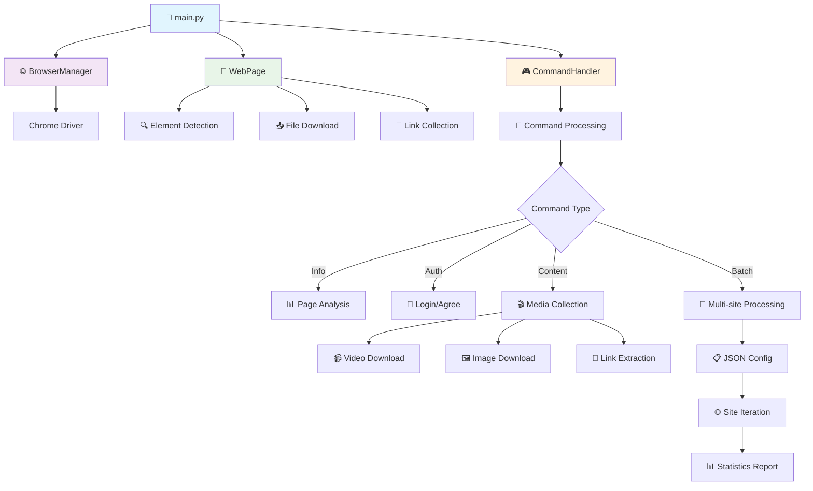
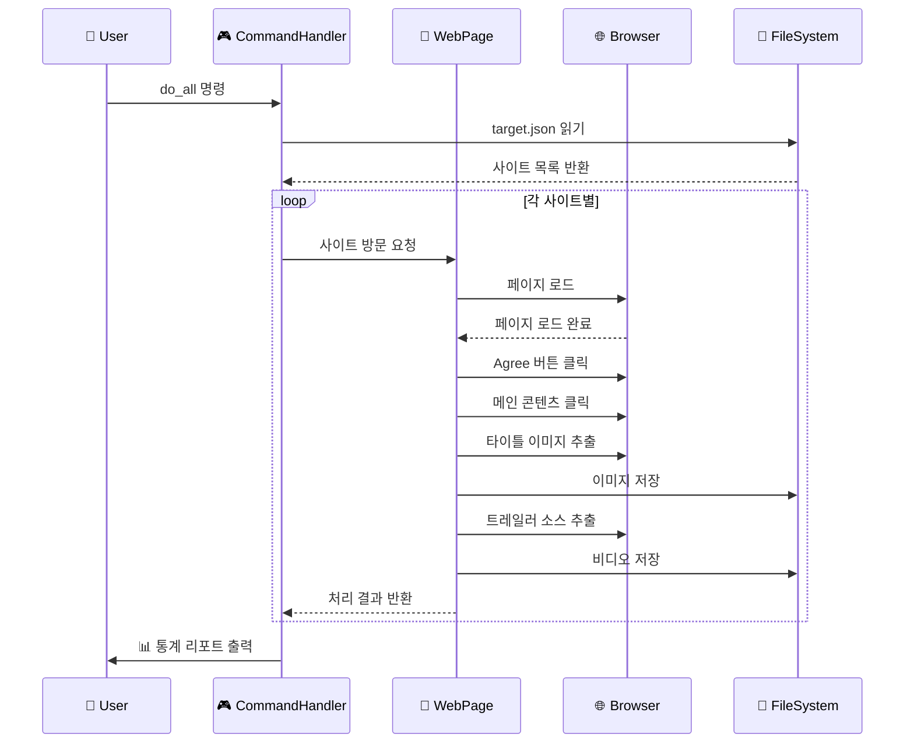

# 🕷️ Selenium Web Scraper

> 🚀 **Python + Selenium을 활용한 인터랙티브 웹 스크래핑 도구**

웹사이트를 자동으로 순회하며 다양한 콘텐츠를 수집하는 강력한 스크래핑 스크립트입니다. 커맨드 기반의 인터랙티브 인터페이스를 통해 유연하고 효율적인 웹 스크래핑을 제공합니다.

## 📋 목차

- [✨ 주요 기능](#-주요-기능)
- [🏗️ 프로젝트 구조](#️-프로젝트-구조)
- [⚙️ 설치 및 설정](#️-설치-및-설정)
- [🎮 사용법](#-사용법)
- [📝 커맨드 가이드](#-커맨드-가이드)
- [🔧 설정 파일](#-설정-파일)
- [🐛 문제 해결](#-문제-해결)
- [📊 프로젝트 아키텍처](#-프로젝트-아키텍처)

## ✨ 주요 기능

### 🎯 핵심 기능
- **🌐 다중 사이트 순회**: JSON 설정 파일을 통한 여러 웹사이트 자동 처리
- **📹 비디오 콘텐츠 수집**: MP4 트레일러 자동 다운로드
- **🖼️ 이미지 수집**: 고해상도 타이틀 이미지 추출 및 저장
- **🔗 링크 수집**: 페이지 내 비디오 링크 자동 수집 및 JSON 저장
- **🤖 스마트 요소 탐지**: CSS 선택자와 XPath를 활용한 다중 백업 전략

### 🛠️ 기술적 특징
- **📊 실시간 통계**: 다운로드/스킵/에러 건수 실시간 추적
- **🔄 중복 방지**: 파일 존재 여부 확인으로 불필요한 다운로드 방지
- **📁 자동 폴더 관리**: 콘텐츠 타입별 자동 폴더 생성 및 분류
- **🐛 강력한 에러 처리**: 단계별 실패에도 프로세스 지속 진행
- **📝 상세 로깅**: 개발/운영 환경별 로그 레벨 자동 조정

## 🏗️ 프로젝트 구조

```
scraping_trailer/
├── 📄 main.py              # 메인 스크립트
├── ⚙️ config.py            # 설정 파일
├── 📝 logger.py            # 로깅 설정
├── 🚨 exceptions.py        # 커스텀 예외 클래스
├── 📋 target.json          # 운영용 사이트 목록
├── 🧪 target_dev.json      # 개발용 사이트 목록
├── 📊 hrefs_*.json         # 수집된 링크 데이터
└── 📁 Downloads/
    ├── 🎬 trailer_mp4/     # MP4 파일 저장소
    └── 🖼️ trailer_title/   # 이미지 파일 저장소
```

## ⚙️ 설치 및 설정

### 📦 필수 패키지 설치

```bash
# Python 패키지 설치
pip install selenium requests

# ChromeDriver 설치 (macOS)
brew install chromedriver

# ChromeDriver 업데이트
brew update && brew upgrade chromedriver
```

### 🔧 초기 설정

1. **설정 파일 수정** (`config.py`)
```python
# 브라우저 설정
BROWSER_CONFIG = {
    'user_data_dir': os.path.expanduser("~/Downloads/temp/chrome-selenium-data"),
    'port': 9222,
    'page_load_wait': 3
}

# 다운로드 경로 설정
DOWNLOAD_CONFIG = {
    'trailer_dir': os.path.expanduser('~/Downloads/trailer_mp4'),
    'title_image_dir': os.path.expanduser('~/Downloads/trailer_title'),
    'default_dir': os.path.expanduser('~/Downloads')
}
```

2. **타겟 사이트 설정** (`target.json` 또는 `target_dev.json`)
```json
{
  "sites": [
    "https://example1.com",
    "https://example2.com"
  ]
}
```

## 🎮 사용법

### 🚀 기본 실행

```bash
# 운영 환경에서 실행
python main.py

# 개발 환경에서 실행 (상세 로그)
ENV=dev python main.py
```

### 💡 실행 예시

```bash
$ python main.py
명령어를 입력하세요 (title/bar/login/loginbtn/agree/agreebtn/main/trailer/do_process/do_all/title_image/save_title_image/collect_hrefs/quit): do_all

2024-01-15 14:30:25 - INFO - 총 3개의 사이트를 처리합니다.
2024-01-15 14:30:28 - INFO - https://example1.com 사이트 방문을 시작합니다.
2024-01-15 14:30:35 - INFO - 트레일러 다운로드 완료: video1.mp4
...

=== 처리 결과 통계 ===
총 사이트 수: 3
트레일러 다운로드 완료: 2
트레일러 스킵된 사이트: 1
에러 발생: 0
===================
```

## 📝 커맨드 가이드

### 🔍 정보 확인 커맨드

| 커맨드 | 설명 | 사용 예시 |
|--------|------|-----------|
| `title` | 현재 페이지 제목 확인 | 페이지 로드 확인용 |
| `bar` | 특정 요소 존재 여부 확인 | 페이지 구조 분석용 |

### 🔐 인증 관련 커맨드

| 커맨드 | 설명 | 동작 방식 |
|--------|------|-----------|
| `login` | 텍스트로 로그인 버튼 클릭 | "로그인" 텍스트 검색 |
| `loginbtn` | 선택자로 로그인 버튼 클릭 | CSS 선택자 사용 |
| `agree` | 텍스트로 동의 버튼 클릭 | "I AGREE" 텍스트 검색 |
| `agreebtn` | 선택자로 동의 버튼 클릭 | CSS 선택자 + XPath 백업 |

### 🎬 콘텐츠 수집 커맨드

| 커맨드 | 설명 | 출력 결과 |
|--------|------|-----------|
| `main` | 메인 콘텐츠 클릭 | 비디오 페이지로 이동 |
| `trailer` | 트레일러 소스 추출 및 다운로드 | MP4 파일 저장 |
| `title_image` | 타이틀 이미지 srcset 출력 | 이미지 URL 정보 |
| `save_title_image` | 타이틀 이미지 다운로드 | 고해상도 이미지 저장 |
| `collect_hrefs` | 페이지 내 비디오 링크 수집 | JSON 파일 생성 |

### 🚀 통합 실행 커맨드

| 커맨드 | 설명 | 처리 과정 |
|--------|------|-----------|
| `do_process` | 단일 페이지 전체 프로세스 실행 | Agree → Main → Title Image → Trailer |
| `do_all` | 모든 사이트 자동 순회 처리 | JSON 파일 기반 일괄 처리 |

### 🔚 시스템 커맨드

| 커맨드 | 설명 |
|--------|------|
| `quit` | 프로그램 종료 |

## 🔧 설정 파일

### 📊 환경별 설정

```python
# 개발/운영 환경 구분
IS_DEV = os.getenv('ENV', 'production').lower() == 'dev'
TARGET_FILE = 'target_dev.json' if IS_DEV else 'target.json'
```

### ⏱️ 대기 시간 설정

```python
WAIT_TIMES = {
    'page_load': 3,      # 페이지 로딩 대기 시간
    'element_wait': 1,   # 요소 탐지 대기 시간
    'after_click': 3     # 클릭 후 대기 시간
}
```

### 🎯 선택자 설정

```python
SELECTORS = {
    'agree_button': "CSS_SELECTOR_HERE",
    'main_content': [
        "PRIMARY_SELECTOR",
        "BACKUP_SELECTOR_1",
        "BACKUP_SELECTOR_2"
    ],
    'trailer_source': "VIDEO_SOURCE_SELECTOR"
}
```

## 🐛 문제 해결

### ⚠️ ChromeDriver 버전 불일치 오류

**에러 메시지:**
```
The chromedriver version (138.0.7204.94) detected in PATH at /opt/homebrew/bin/chromedriver 
might not be compatible with the detected chrome version (139.0.7258.139); 
currently, chromedriver 139.0.7258.138 is recommended for chrome 139.*
```

**해결 방법:**
```bash
# ChromeDriver 업데이트
brew update
brew upgrade chromedriver

# 버전 확인
chromedriver --version
google-chrome --version
```

### 🔍 일반적인 문제 해결

#### 1. 요소를 찾을 수 없는 경우
- 페이지 로딩 시간 증가: `WAIT_TIMES['page_load']` 값 조정
- 선택자 업데이트: 웹사이트 구조 변경 시 `config.py`의 선택자 수정
- XPath 백업 활용: CSS 선택자 실패 시 자동으로 XPath 시도

#### 2. 다운로드 실패
- 네트워크 연결 확인
- 다운로드 폴더 권한 확인
- 파일 용량 및 디스크 공간 확인

#### 3. 브라우저 세션 문제
- Chrome 프로세스 종료 후 재시작
- 사용자 데이터 디렉토리 정리: `~/Downloads/temp/chrome-selenium-data`

## 📊 프로젝트 아키텍처



### 🔄 프로세스 플로우



## 🎯 학습 포인트

이 프로젝트를 통해 다음을 학습할 수 있습니다:

### 🐍 Python & Selenium
- **WebDriver 관리**: 브라우저 세션 생성 및 재사용
- **요소 탐지 전략**: CSS 선택자, XPath, 명시적 대기
- **예외 처리**: 단계별 실패 처리 및 복구 전략

### 🏗️ 소프트웨어 아키텍처
- **모듈화 설계**: 기능별 클래스 분리 및 책임 분담
- **설정 관리**: 환경별 설정 분리 및 유연한 구성
- **로깅 시스템**: 레벨별 로그 관리 및 디버깅

### 🔄 자동화 패턴
- **커맨드 패턴**: 명령어 기반 인터페이스 구현
- **배치 처리**: 대량 데이터 자동 수집 및 처리
- **상태 관리**: 프로세스 진행 상황 추적 및 통계

---

## 📜 라이선스

이 프로젝트는 학습 목적으로 제작되었습니다. 웹 스크래핑 시 해당 웹사이트의 robots.txt 및 이용약관을 준수해 주세요.

## 🤝 기여하기

버그 리포트나 기능 제안은 언제든 환영합니다! 

---

**⭐ 이 프로젝트가 도움이 되었다면 스타를 눌러주세요!**
